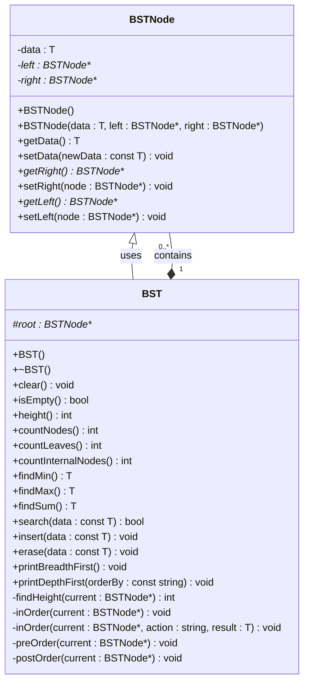

# Binary Search Tree (BST)

## Features
- **Insert**: Add elements to the BST.
- **Erase**: Remove nodes from the BST.
- **Search**: Check if an element exists in the BST.
- **Traversal**: Supports in-order, pre-order, post-order, and breadth-first traversals.
- **Find Min/Max**: Find the smallest and largest elements in the BST.
- **Height Calculation**: Calculate the height of the tree.
- **Counting Nodes and Leaves**: Count the number of nodes and leaves in the tree.
- **Sum of Elements**: Calculate the sum of all elements in the BST.

## UML Diagram

