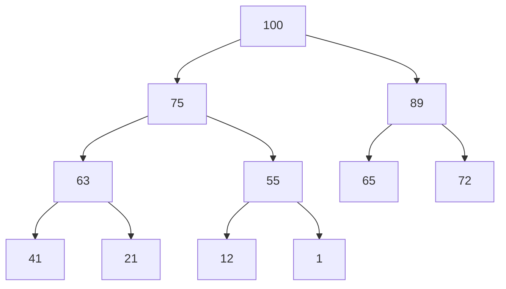
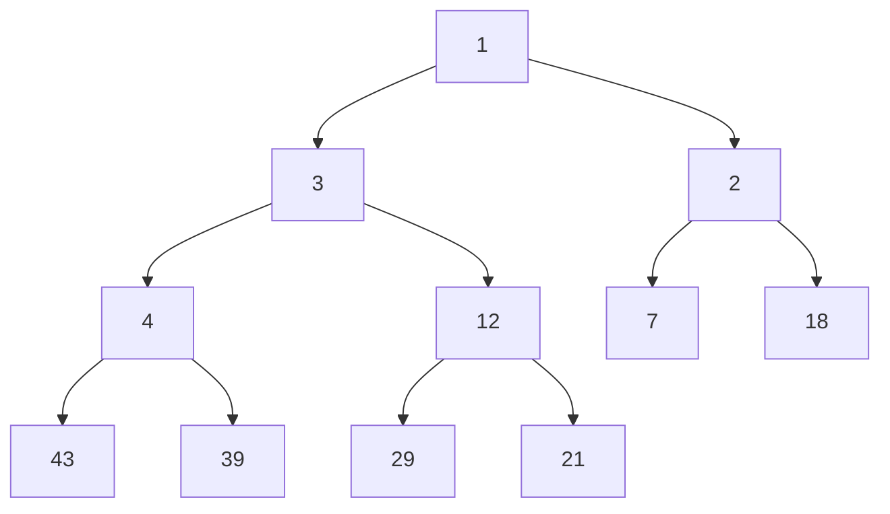

# 🚁 Heap

> A heap is a complete binary tree, and the binary tree is a tree in which the node can have utmost two children. Before knowing more about the heap data structure, we should know about the complete binary tree.

A Heap is a special Tree-based data structure in which the tree is a complete binary tree. Generally, Heaps can be of two types:

1. Max-Heap: In a Max-Heap the key present at the root node must be greatest among the keys present at all of it’s children. The same property must be recursively true for all sub-trees in that Binary Tree.
2. Min-Heap: In a Min-Heap the key present at the root node must be minimum among the keys present at all of it’s children. The same property must be recursively true for all sub-trees in that Binary Tree.

## ⬆️ Max-Heap

## ⬇️ Min-Heap

