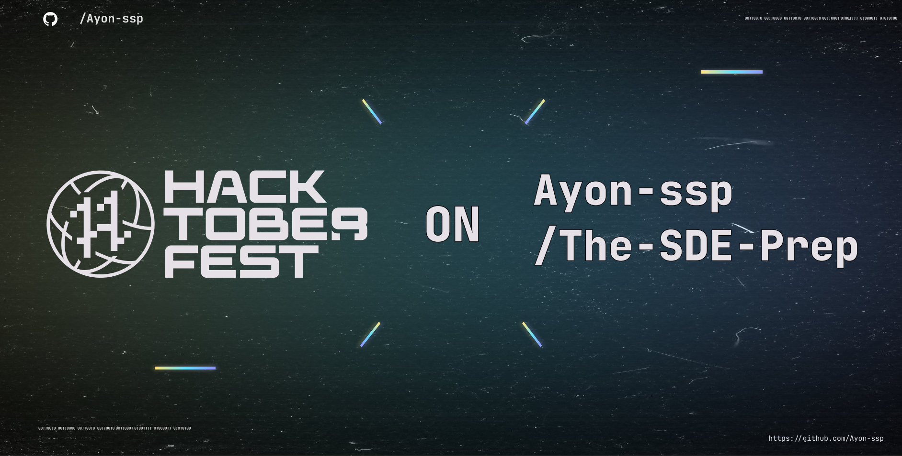

# The SDE Preparation

[](etc/CREDITS.md)

All the DSA(Data-Structures & Algorithms), Concepts and Implementations

```cmd
- 🎯 | [Aim] :- Help Students who are preparing for SDE Interview.
- 📈 | FAANG Must Do Problems
- 🔰 | CP
- 📑 | SDE Sheet's
- 🖊️ | CSE Core Subjects (DBMS + MySql, OOP's, OS & CN)
- ✏️ | Round 1(Aptitude, Logical Reasoning, Puzzle's, Programing MCQ's & Verbal ability) and 🃏Projects.
```

 <!--  -->

[](https://visitorbadge.io/status?path=https%3A%2F%2Fgithub.com%2FAyon-SSP%2FThe-SDE-Prep)

**_If you appreciate my work, please 🌟 this repository. It motivates me. 🚀🚀_**

<!-- 
<a href="https://visitorbadge.io/status?path=https%3A%2F%2Fgithub.com%2FAyon-SSP%2FThe-SDE-Prep"></a> -->

<!-- ## Data Structures
## Algorithms
## Projects -->

> REFER TO [CONTRIBUTING.md](CONTRIBUTING.md) FOR CONTRIBUTING GUIDELINES.
